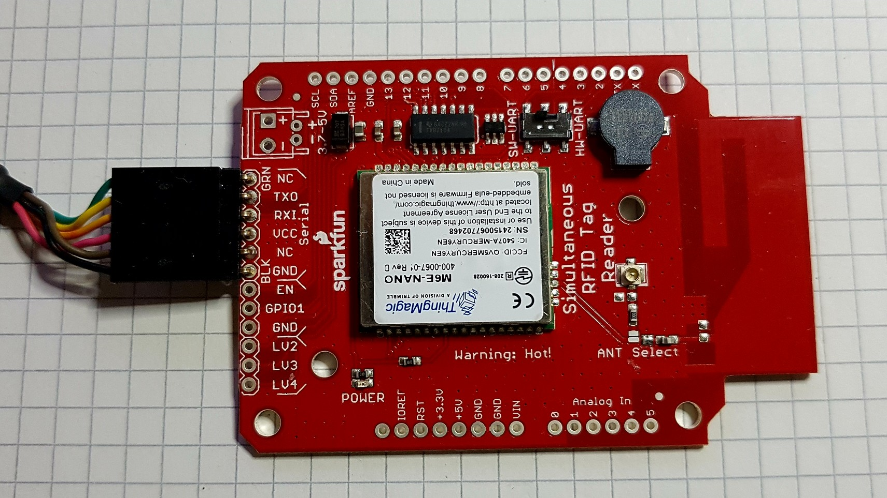
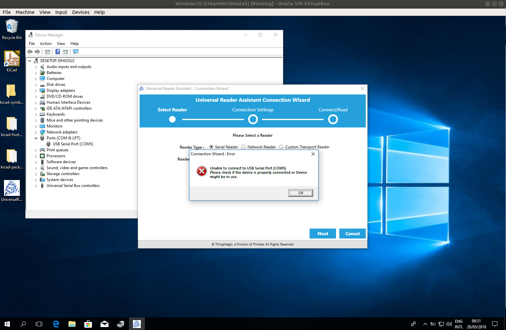
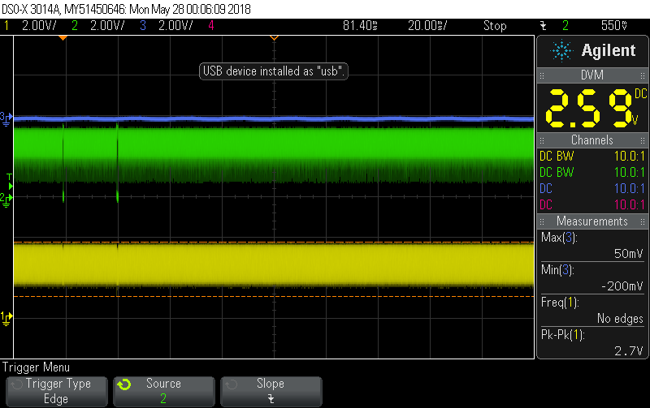
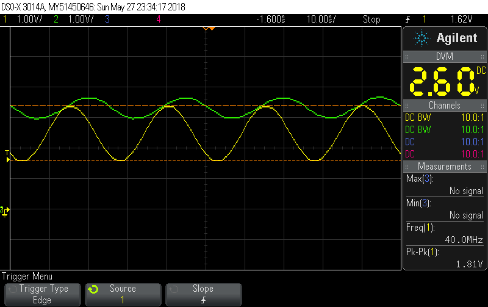
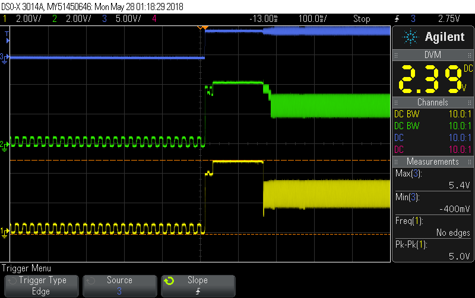

# SEN-14066_Troubleshooting

I'm having difficulty establishing communication with the SEN-14066 board through the FTDI UART connector.

I've tried the Universal Reader Assistant on both Windows 10 (both VM and real machine) using genuine FTDI
cable without any success. The OS recognizes the FTDI cable and assigns a COM port to it.
On opening the Universal Reader Assistant, it scans the COM port but times out (see screen grab).

I probed the TXO and TXI lines with an oscillocope to make sure signals are going in both direction. Please
see scope screen grab below. I can see small bursts of traffic in the RXI line (green), but nothing
on return (yellow). 

However of more concern is a very large high frequency signal superimposed on the UART lines. My first
thought was this was UHF from the transmitter, but I measured
the frequency to be exactly 40MHz: not the 900MHz or so from the transmitter. I suspect 
this signal is prevening the UART from functioning. 

Other obserations: the power LED is on. The board does get warm. On my SDR I can see a strong 
signal at about 900MHz while the board is powered.

This is the scope trace when I plug in the FTDI cable. Blue is Vcc.

Do you have any suggestions on further troublshooting?

BTW I can assure you, because of the relatively high cost of the board, it has been treated with the
upmost care.  

Update 28 May 2018: More observations:

 * I connected to FTDI cable UART port with Linux picocom: garbage is being printed on the terminal screen dispite the oscilloscope trace showing no data activity on the incomig line (TXO from the board).  It seems this 40MHz noise signal is definately interfering with UART operation.

 * When sending random characters via picocom terminal program, I can see the UART data (with the super-imposed noise signal) on both sides of the buffer chip. I don't see any data being transmitted from the board on either side of the buffer chip.
 
 * Sending any character to the board seems to randomly change the amplitude of the noise signal.
 
 * I wonder is it getting enough power from FTDI cable? Vcc also has this 40MHz noise oscillating from about 4.6V to 5.0V. [No I don't think so. Just tried powering from a separate 5V PSU. Drawing 200mA. But noise signal still there.] 

